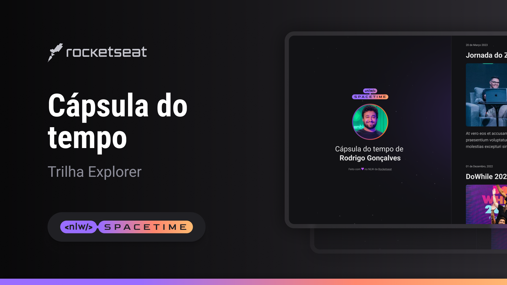

  

## 💻 Projeto
Esse é um projeto web responsivo de uma cápsula do tempo para exibir memórias numa linha do tempo.

## ⚡ Tecnologia
Esse projeto foi desenvolvido durante o NLW da Rocketseat com as seguintes tecnologias:

- HTML
- CSS
- Git e Github

## 🎨 Layout
Você pode visualizar o layout do projeto através [desse link] (https://www.figma.com/file/pKxVqoIhw8SuObL9Q5ROie/C%C3%A1psula-do-tempo-%E2%80%A2-Trilha-Explorer-(Community)?type=design&node-id=306%3A84&t=2f8HtvwTd8N1El2D-1)